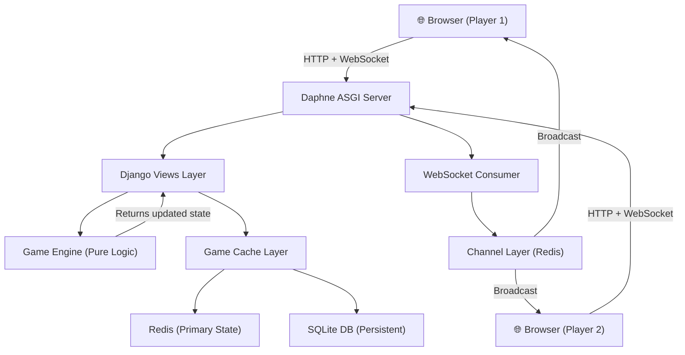
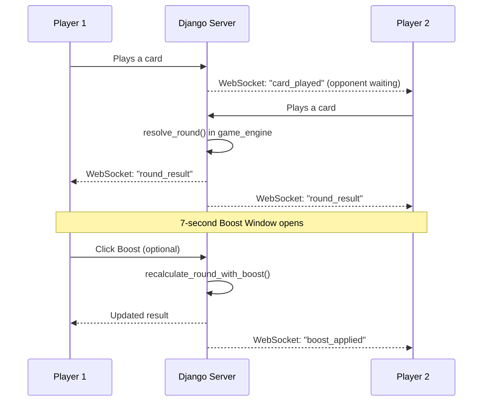

# 🏏 S7 (Super 7) — Project Overview

## What Is It?

**S7 (Super 7)** is a **real-time multiplayer cricket card game** built with **Django 6**, where two players compete head-to-head in a strategic 7-round match using cricket-themed player cards. It recreates the nostalgia of childhood cricket card games in a modern, online format — think **street cricket meets card strategy**, playable from anywhere.

> **Live URL:** [https://super7.onrender.com/app](https://super7.onrender.com)

---

## 📊 Project Status

| Area | Status | Details |
|------|--------|---------|
| **Core Gameplay** | ✅ Fully Functional | Toss → 2 innings → 7 rounds each → result |
| **Multiplayer (Real-time)** | ✅ Live | WebSockets via Django Channels + Redis |
| **Deck Building** | ✅ Complete | Create, build, swap cards, activate decks |
| **Ability System** | ✅ Complete | 11 unique abilities (batting + bowling) |
| **Boost System** | ✅ Complete | Pre-round & post-round boost mechanics |
| **Support Cards** | ✅ Complete | Batting, Pace, and Spin support cards |
| **Tournament System** | 🔶 In Progress | Models & views exist; bracket/fixture generation pending |
| **Season System** | 🔶 In Progress | Season CRUD exists; full integration in progress |
| **Leaderboard** | ✅ Complete | Rankings and player stats |
| **Spectator Mode** | ✅ Complete | Watch live matches in progress |
| **User Profiles** | ✅ Complete | Match history, stats, deck management |
| **Deployment** | ✅ Deployed | Render (web) + Redis (state caching) |

---

## 🏗️ How It Works — Architecture

### Tech Stack

| Layer | Technology |
|-------|------------|
| **Backend Framework** | Django 6.0.6 (Python) |
| **Real-Time Communication** | Django Channels + Daphne (ASGI) + WebSockets |
| **State Management** | Redis (primary, fast) → SQLite (fallback/persistence) |
| **Frontend** | Server-rendered Django templates (HTML + JS + CSS) |
| **Image Handling** | Pillow |
| **Deployment** | Render + Whitenoise (static files) |

### Architecture Diagram



### Key Design Decisions

1. **Separation of Concerns:** The [game_engine.py](file:///c:/Users/JOHN/OneDrive/Desktop/boostoption/s7app/game_engine.py) has **zero Django/HTTP awareness** — pure game-rules math. Views handle HTTP, DB, and WebSocket orchestration.

2. **Two-Tier State Storage** ([game_cache.py](file:///c:/Users/JOHN/OneDrive/Desktop/boostoption/s7app/game_cache.py)): Redis for speed (every round), SQLite for durability (innings transitions, game over). This prevents Redis-only data loss while keeping gameplay snappy.

3. **WebSocket Notifications** ([consumers.py](file:///c:/Users/JOHN/OneDrive/Desktop/boostoption/s7app/consumers.py)): The `GameConsumer` broadcasts events like `card_played`, `round_result`, `innings_over`, `game_over`, and `boost_applied` to keep both players in sync.

4. **Modular Views:** Views are cleanly split across 8 files in [views/](file:///c:/Users/JOHN/OneDrive/Desktop/boostoption/s7app/views):
   - [game_views.py](file:///c:/Users/JOHN/OneDrive/Desktop/boostoption/s7app/views/game_views.py) — Core match gameplay & result
   - [room_views.py](file:///c:/Users/JOHN/OneDrive/Desktop/boostoption/s7app/views/room_views.py) — Room creation, joining, waiting
   - [toss_views.py](file:///c:/Users/JOHN/OneDrive/Desktop/boostoption/s7app/views/toss_views.py) — Toss mechanics
   - [deck_views.py](file:///c:/Users/JOHN/OneDrive/Desktop/boostoption/s7app/views/deck_views.py) — Deck building & management
   - [tournament_views.py](file:///c:/Users/JOHN/OneDrive/Desktop/boostoption/s7app/views/tournament_views.py) — Tournaments
   - [stats_views.py](file:///c:/Users/JOHN/OneDrive/Desktop/boostoption/s7app/views/stats_views.py) — Leaderboard & profiles

---

## 🎮 Gameplay — Full Breakdown

### Phase 1: Pre-Match Setup

#### 🃏 Deck Building
- Players own up to **2 decks**, each tied to a **Team** (e.g., India, Australia).
- Each deck is built from [PlayerCard](file:///c:/Users/JOHN/OneDrive/Desktop/boostoption/s7app/models.py#L22-L52) objects with stats: **Batting**, **Bowling**, **Runs**, **Ability**, **Weightage**, and **is_spinner** flag.
- Cards are slotted into decks via [DeckCard](file:///c:/Users/JOHN/OneDrive/Desktop/boostoption/s7app/models.py#L108-L117) (with slot ordering). Players can **swap cards** between decks.
- One deck is set as **active** before entering a match.
- Admins can assign **Prize Cards** ([UserPrizeCard](file:///c:/Users/JOHN/OneDrive/Desktop/boostoption/s7app/models.py#L121-L133)) to specific users as rewards.

#### 🏟️ Matchmaking
- **Create or Join a Room** with a unique 8-character code.
- A [GameRoom](file:///c:/Users/JOHN/OneDrive/Desktop/boostoption/s7app/models.py#L64-L82) tracks: both players, game state (JSONField), status (`waiting` → `live` → `completed`), and each player's locked-in deck.
- The **Waiting Room** uses WebSockets to instantly notify when Player 2 joins.

---

### Phase 2: The Toss

1. Player calls **Heads or Tails**.
2. A random outcome is generated. The winner chooses to **Bat First** or **Field First**.
3. If the player loses, the computer/opponent makes the choice.
4. State keys updated: `toss_result`, `toss_winner`, `toss_done`, `innings_chosen`, `batting_first`.

---

### Phase 3: The Match (2 Innings × 7 Rounds)

#### Each Round Flow:


#### Round Resolution Logic ([resolve_round](file:///c:/Users/JOHN/OneDrive/Desktop/boostoption/s7app/game_engine.py#L210-L360)):

| Condition | Outcome |
|-----------|---------|
| `effective_batting > effective_bowling` | **Runs scored** (card's `runs` value added to score) |
| `effective_batting == effective_bowling` | **Tie** — partial runs: `⌊runs/3 + 0.5⌋` |
| `effective_batting < effective_bowling` | **Wicket falls** 🎯 |

#### The Runs Cutter Exception:
If the bowler has the **Runs Cutter** ability and the batter does NOT have **Spin Basher**, the batter's runs are reduced by 10 (min 0), even if they win the round.

---

### Phase 4: Ability System (11 Abilities)

Each card can have **one special ability** that triggers under specific conditions, adding **+10** to the relevant stat:

#### ⚡ Batting Abilities
| Ability | Trigger | Effect |
|---------|---------|--------|
| **Opener** | Rounds 1–2 | +10 batting |
| **Finisher** | Rounds 6–7 | +10 batting |
| **Mid Over Hitter** | Rounds 3–5 | +10 batting |
| **Spin Basher** | vs. Spinner bowler | +10 batting |
| **Saviour** | Wicket fell in last 2 rounds | +10 batting |

#### 🎯 Bowling Abilities
| Ability | Trigger | Effect |
|---------|---------|--------|
| **Powerplay Specialist** | Rounds 1–2 | +10 bowling |
| **Death Specialist** | Rounds 6–7 | +10 bowling |
| **Mid Over Specialist** | Rounds 3–5 | +10 bowling |
| **Golden Arm** | 30+ runs scored in last 2 rounds | +10 bowling |
| **Breakthrough** | Opponent at 60+ total runs | +10 bowling |
| **Runs Cutter** | Always (if batter ≠ Spin Basher) | −10 from batter's runs |

---

### Phase 5: Boost System

A strategic layer on top of abilities:

#### Pre-Round Boost
- **Once per match**, a player can activate a boost **before** playing their card → **+10** to their stat.
- If a **Spin Basher** triggers on the same round, the boost is **refunded** (Spin Basher takes priority).

#### Post-Round Boost (7-Second Window)
- After each round resolves, a **7-second window** opens.
- Players whose ability did **NOT** trigger can click to apply a **+10 post-boost**.
- The round is **recalculated** in real-time ([recalculate_round_with_boost](file:///c:/Users/JOHN/OneDrive/Desktop/boostoption/s7app/game_engine.py#L430-L549)) — outcomes can flip from wicket to runs or vice versa.
- Both players see the update via WebSocket broadcast.

---

### Phase 6: Support Cards

[SupportCard](file:///c:/Users/JOHN/OneDrive/Desktop/boostoption/s7app/models.py#L5-L18) — Once per innings, a player can activate a support card that gives **+2** bonus for **3 consecutive rounds**:

| Support Type | Effect |
|-------------|--------|
| **Batting Support** | +2 batting for the batter |
| **Pace Support** | +2 bowling (only for pace bowlers) |
| **Spin Support** | +2 bowling (only for spinner bowlers) |

---

### Phase 7: Innings Transition & Game Over

#### After Innings 1 (7 rounds or 10 wickets):
- **Target** is set: `first_innings_score + 1`
- Roles swap: the batting team bowls, and vice versa.

#### After Innings 2:
| Condition | Result |
|-----------|--------|
| Chasing team reaches target | **Chasing team wins** |
| Chasing team falls short | **Defending team wins** |
| Scores tied | **Tie** |
| 10 wickets fall early | Innings ends immediately |

---

### Phase 8: Post-Match

- Final scores and wickets displayed on result page.
- Match history is saved to the database.
- Players can view stats on their **Profile** page.
- Results feed into the **Leaderboard** rankings.
- Spectators watching live see the final result via WebSocket.

---

## 🏆 Tournament & Season System (In Progress)

### Seasons ([Season](file:///c:/Users/JOHN/OneDrive/Desktop/boostoption/s7app/models.py#L150-L186))
- Admin-managed time periods (e.g., "Season 1", "2026-Q1")
- Only **one active season** at a time (enforced via DB constraint)

### Tournaments ([Tournament](file:///c:/Users/JOHN/OneDrive/Desktop/boostoption/s7app/models.py#L193-L275))
- Formats: **Round Robin** or **Knockout**
- Point system: Win=2, Tie=1, Loss=0 (bonus points placeholder ready)
- Manual seeding by admin
- Participants ([TournamentParticipant](file:///c:/Users/JOHN/OneDrive/Desktop/boostoption/s7app/models.py#L282-L328)) lock in their decks
- `calculate_bonus_points()` is a future extension point

---

## 📁 Project Structure Summary

```
boostoption/
├── s7/                      # Django project settings
│   ├── settings.py          # ASGI, Redis, Channels config
│   ├── asgi.py              # ASGI entry (Daphne)
│   └── urls.py              # Root URL config
├── s7app/                   # Main application
│   ├── models.py            # 9 models (PlayerCard, GameRoom, Deck, Tournament, etc.)
│   ├── game_engine.py       # Pure game logic (550 lines, zero Django awareness)
│   ├── game_cache.py        # Redis + DB two-tier state management
│   ├── consumers.py         # WebSocket consumer (8 broadcast event types)
│   ├── views/               # 8 modular view files
│   ├── templates/           # 19 HTML templates + partials
│   └── static/              # CSS, JS, images
├── media/                   # Uploaded card images, team logos
├── db.sqlite3               # SQLite database
├── requirements.txt         # 47 dependencies
└── manage.py
```

> [!TIP]
> The cleanest part of this codebase is the **game_engine.py** — it's a pure-logic module with a 60-line state-key schema documented at the top, making it easy to reason about, test, and extend without touching any Django code.
